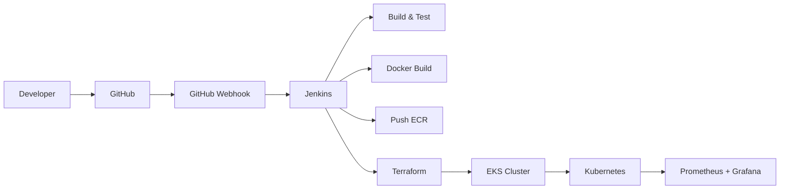

# DevOps CI/CD AWS Portfolio Project

## Project Overview
This repository provides a production-style project skeleton for a personal DevOps portfolio focused on Jenkins, AWS, Docker, Kubernetes, Terraform, and monitoring.

It is intentionally designed as a learning and showcase project for internship or junior DevOps roles.

## Architecture Diagram


## Technologies Used
- Git and GitHub
- Jenkins and GitHub Webhook
- Docker and Docker Compose
- AWS services
- Terraform
- Kubernetes and EKS
- Amazon ECR
- Prometheus and Grafana

## Folder Structure
```text
devops-cicd-aws/
├── app/
├── docker/
├── terraform/
├── kubernetes/
├── helm/
├── jenkins/
├── monitoring/
├── scripts/
├── docs/
├── .github/
├── README.md
└── .gitignore
```

## CI/CD Flow
1. Developer pushes changes to GitHub.
2. GitHub webhook triggers Jenkins.
3. Jenkins runs build and test stages.
4. Docker image is built and pushed to Amazon ECR.
5. Terraform provisions or updates AWS infrastructure.
6. Kubernetes manifests or Helm charts deploy the app to EKS.
7. Monitoring dashboards collect metrics from the cluster.

## Infrastructure Diagram
- VPC with public and private subnets
- Internet Gateway and NAT Gateway
- Security Groups and IAM roles
- ECR repository
- EKS cluster for workloads
- Jenkins EC2 instance for CI/CD automation

## Deployment Flow
1. Provision infrastructure with Terraform.
2. Build and push container images.
3. Apply Kubernetes manifests or Helm charts.
4. Verify service health and monitoring.

## Future Improvements
- Add real application services
- Implement full CI/CD pipelines with automated deployment
- Add test automation and quality gates
- Add Argo CD or Flux for GitOps
- Harden security with IAM best practices and secrets management

## Notes
All application code, infrastructure definitions, and deployment manifests in this repository are intentionally placeholders for portfolio use.
